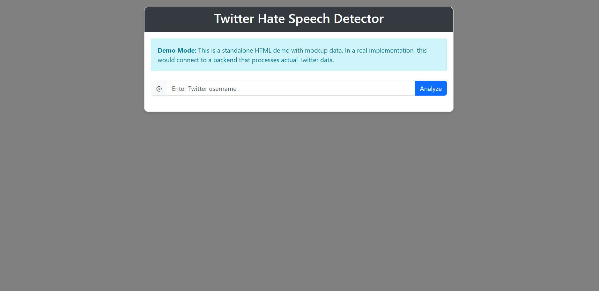

# Twitter Content Analysis Web Application

A Flask-based web tool for analyzing Twitter content to identify potentially offensive language and images. This application provides an intuitive interface to fetch and analyze a user's recent tweets, generating a summary report with content statistics.


---

### 🖥️ Application Interface




---

## Table of Contents

- [Key Features](#key-features)
- [Technology Stack](#technology-stack)
- [How It Works](#how-it-works)
- [Getting Started](#getting-started)
  - [Prerequisites](#prerequisites)
  - [Installation & Configuration](#installation--configuration)
- [Running the Application](#running-the-application)
- [Project Structure](#project-structure)
- [Future Roadmap](#future-roadmap)
- [License](#license)
- [Acknowledgments](#acknowledgments)

---

## ✨ Key Features

- **Dynamic Content Fetching**: Retrieves recent tweets and associated media from any public Twitter profile using the Twitter API.
- **Sentiment & Hate Speech Analysis**: Implements a baseline keyword-based classifier to score tweet text for negative, offensive, or hate speech content.
- **Extensible Image Moderation**: Includes a foundational module for analyzing images, designed for future integration with advanced computer vision models.
- **Insightful Dashboard**: Generates and displays summary statistics and visualizations for a clear, at-a-glance overview of the analysis results.
- **User-Friendly Web Interface**: A clean and simple single-page application built with Flask and HTML/CSS for easy interaction.

---

## 🛠️ Technology Stack

| Category          | Technologies                                                              |
| ----------------- | ------------------------------------------------------------------------- |
| **Backend**         | Python, Flask                                                             |
| **API Integration** | Tweepy                                                                    |
| **Data Science**     | NumPy, Pandas, Matplotlib                                                 |
| **Image Processing**| Pillow (PIL)                                                              |
| **Frontend**        | HTML, CSS, JavaScript (via Flask Jinja2 templates)                        |

---

## ⚙️ How It Works

The application follows a two-pronged approach for content analysis: one for text and one for images.

### Text Classification
The text analysis pipeline uses a straightforward and efficient keyword-based classification model as a baseline.
1.  **Preprocessing**: The raw text of each tweet is cleaned by removing URLs, mentions, hashtags, and special characters to isolate the core content.
2.  **Scoring**: The system counts the occurrences of words from predefined "positive" and "negative/offensive" word lists.
3.  **Categorization**: Based on the resulting sentiment score, each tweet is classified into one of three categories: **Normal**, **Offensive**, or **Hate Speech**.

### Image Classification
The current implementation features a placeholder for image analysis, which serves as a foundation for future development.
1.  **Image Retrieval**: The application first verifies that an image attached to a tweet is accessible by downloading it.
2.  **Default Classification**: It currently returns a "Normal" classification for all valid images.
3.  **Future Extensibility**: This module is designed to be easily replaced with a more sophisticated deep learning model (e.g., a CNN) for actual image content analysis.

---

## 🚀 Getting Started

Follow these instructions to set up and run the project locally.

### Prerequisites
- Python 3.8 or higher
- A [Twitter Developer Account](https://developer.twitter.com/en/apply-for-access) with API keys and tokens for a v2 project.

### Installation & Configuration

1.  **Clone this repository:**
    ```bash
    git clone https://github.com/MananJK/Twitter-X-Hate-Speech-Detector.git
    cd Twitter-X-Hate-Speech-Detector
    ```

2.  **Create and activate a virtual environment:**
    ```bash
    # Create the environment
    python -m venv venv
    
    # Activate on Windows
    .\venv\Scripts\activate
    
    # Activate on macOS/Linux
    source venv/bin/activate
    ```

3.  **Install the required dependencies:**
    ```bash
    pip install -r requirements.txt
    ```

4.  **Configure API Credentials:**
    Open the `appgit.py` file and replace the placeholder values with your own Twitter API credentials.

    ```python
    consumer_key = "your-consumer-key"
    consumer_secret = "your-consumer-secret"
    access_token = "your-access-token"
    access_token_secret = "your-access-token-secret"
    bearer_token = "your-bearer-token"
    ```
    > **Note:** It is best practice to use environment variables to store sensitive credentials rather than hardcoding them directly in the source code.

---

## ▶️ Running the Application

1.  **Start the Flask development server:**
    ```bash
    python appgit.py
    ```

2.  **Access the web interface:**
    Open your web browser and navigate to `http://127.0.0.1:5000/`.

3.  **Analyze a Profile:**
    Enter a Twitter username (e.g., `twitter` or `@twitter`) and click "Analyze" to view the report.

---

## 📁 Project Structure

twitter-content-analysis/ 
          ├── appgit.py # Main Flask application with all routes and logic 
          ├── templates/ 
                └── index.html # Jinja2 template for the main web interface 
          ├── static/ # Static assets
                ├── css # CSS template designs
                └── js # JS template designs
          ├── requirements.txt # List of Python dependencies for pip 
          └── README.md # Project documentation


---

## 🗺️ Future Roadmap

- **Advanced ML Models**: Integrate NLP models (e.g., using `scikit-learn` or `Hugging Face Transformers`) for more nuanced text classification.
- **True Image Recognition**: Implement a pre-trained computer vision model (like ResNet or VGG) to classify images for sensitive content.
- **User Authentication**: Add a user login system to allow users to save and view past analysis reports.
- **Caching**: Implement a caching system (like Redis) to improve performance and avoid re-analyzing recently requested profiles.
- **Containerization**: Add a `Dockerfile` to allow for easy deployment using Docker.

---

## 📜 License

This project is distributed under the MIT License. See the `LICENSE` file for more information.

---

## 🙏 Acknowledgments

- The open-source communities behind Python and Flask.
- The developers of the Tweepy library for simplifying interaction with the Twitter API.
